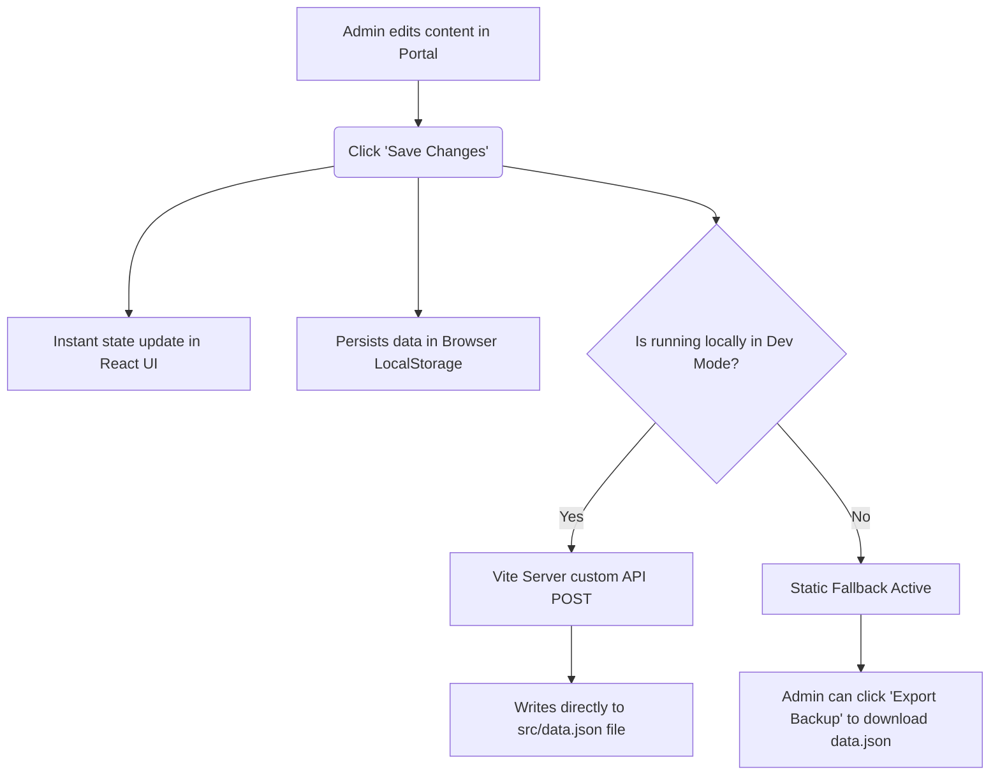

# Radhe DJ & Event — Dynamic CMS & Admin Panel Guide

Welcome to your new **Dynamic Content Management System (CMS)** and passcode-protected **Admin Panel**! Your website is now 100% dynamic, allowing you to edit every single detail—from the main Hero banner to each feature in the pricing packages—without touching a single line of code.

---

## 🔒 Accessing the Admin Portal

To prevent random visitors from making changes to your website, the Admin Panel is secured behind a passcode lock:

1. **Scroll to the Footer:** Scroll down to the absolute bottom of the homepage.
2. **Click "Admin Portal":** Next to your copyright text, you will find a discrete lock icon and link: `🔒 Admin Portal`.
3. **Enter the Passcode:** 
   * **Default Passcode:** `radhe123`
4. **Access the Dashboard:** Once entered, a premium, glassmorphic full-screen editor will overlay, showing the sections you can modify.

> [!TIP]
> You can change the passcode to anything you like by navigating to the **System & Security** tab inside the Admin Dashboard.

---

## 🛠️ Dynamic Sections Breakdown

Inside the Admin Portal, you can control **every section** through 9 dedicated tabs:

| Tab Name | What You Can Edit | Interactive Features |
| :--- | :--- | :--- |
| **Hero Section** | Header Badge, Main Title, Glow Subtitle, explore button texts/links. | **Image URL Field** with instant preview display. |
| **About & Stats** | About badge, title, long description, experience float values, and the 4 statistics cards. | **Dynamic List Builder** to add, edit, or delete bullet points and change icons from a dropdown. |
| **Specialties** | The signature services grid (Title, Description, Card Accent Color). | **Complete CRUD** to add new cards or remove old ones, with an built-in Lucide icon selector. |
| **Gallery Grid** | The moments gallery grid (URLs, captions, seed). | Add new images or remove old images from the layout. |
| **Pricing Packages** | Silver, Gold, Diamond packages (Titles, Subheadings, featured tags). | **Dynamic Multi-List builder** to add/delete features inside individual packages! |
| **Testimonials** | Customer reviews (Name, role, text). | Add reviews or delete old reviews. Features 5-star automatic renders. |
| **FAQs List** | Frequently Asked Questions & Answers. | Add/edit/delete FAQs. The accordion expands dynamically on the storefront. |
| **Contact Details** | Store address, phone numbers (Chintan & Mehul Patel), raw phone dials, email, Instagram, YouTube, and WhatsApp links. | Instantly binds across header CTAs, footer contact rows, and floating action buttons! |
| **System & Security** | Security passcode, local server information, and backup system. | Full backup imports, exports, and factory resets. |

---

## 💾 How Your Changes are Saved (Option 3 Architecture)

To give you a backend experience without requiring a separate web server or database subscription, we built a **Hybrid local-persistence system**:

### 1. In Local Development (`npm run dev`)
When you are running the project on your computer:
* Clicking **"Save Changes"** triggers a POST request to `/api/save-data`.
* Our custom **Vite middleware plugin** (`vite.config.js`) intercepts this request and writes your modifications **directly into `src/data.json`** on your computer.
* This means your changes are permanently saved in your source files instantly!

### 2. In Production (Static Hostings like Netlify / Vercel / GitHub Pages)
If you publish your site as a compiled static website:
* Clicking **"Save Changes"** will save your changes instantly in the visitor's local browser (`LocalStorage`).
* To make changes permanent for everyone in production, simply make the edits in your browser, click **"Export Backup"** to download the updated `data.json`, and replace the `src/data.json` file in your source code repository!

---

## 🛡️ Backup & Restore Utilities

At the top-right corner of the Admin Dashboard, we have implemented powerful controls to prevent data loss:

* **💾 Save Changes:** Applies all your current edits, updating the database.
* **📥 Export Backup:** Downloads a copy of your current configuration as a `data.json` file.
* **📤 Import Backup:** Allows you to upload a previously saved `data.json` file to instantly restore all text, images, and services.
* **🔄 Factory Reset (Sidebar Bottom):** Instantly restores the original, beautiful default text and settings of the Radhe DJ website.

---

> [!IMPORTANT]
> The dynamic binding automatically sanitizes phone links (e.g. `tel:9624047940` dials Chintan Patel directly) and maps social links to floating action buttons. All components use responsive, glassmorphic layout wrappers ensuring gorgeous visual looks on both mobile and desktop screens.
